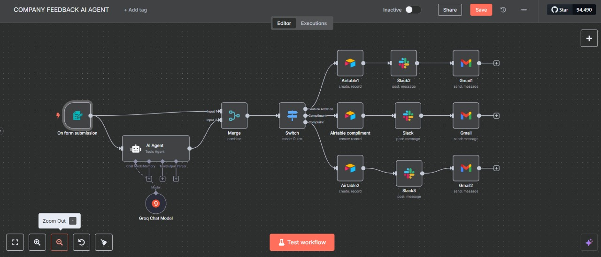

# COMPANY FEEDBACK Al AGENT
# 🤖 AI Feedback Sorting Agent (n8n-based)

This project is a smart AI-powered workflow built using [n8n](https://n8n.io/). It automatically categorizes customer feedback into:
- ✅ Compliments
- 🛠️ Feature Requests
- ❗ Complaints

Then it:
- 🔁 Sends categorized messages to specific Slack channels
- 📧 Sends follow-up emails to customers after resolution

---

## 🔧 Built With

- 🧠 OpenAI (for feedback classification)
- 🔁 n8n (workflow automation)
- 💬 Slack
- 📩 Email (via SMTP or any provider)

---

## 📦 Project Structure

- `workflows/` — Contains the exported JSON for the n8n workflow
- `assets/` — Screenshots or visuals of your workflow
- `README.md` — Documentation and usage instructions

---

## 🧠 How It Works

1. User submits feedback via a form or webhook
2. Feedback is sent to OpenAI for classification
3. n8n routes the message based on category:
   - Sends Slack messages to the right channel
   - Emails customers after their issue/request is addressed

---

## 🚀 Getting Started

1. Clone the repo
2. Import the `.json` file into your n8n instance
3. Set up required credentials (OpenAI, Slack, Email)
4. Run the workflow or trigger via webhook

---

## 📸 Screenshots

---

## ✨ Credits

Created by [Manoj Kumar Sinha](https://github.com/mksinha01)  

---

## 📄 License

[MIT](LICENSE)
